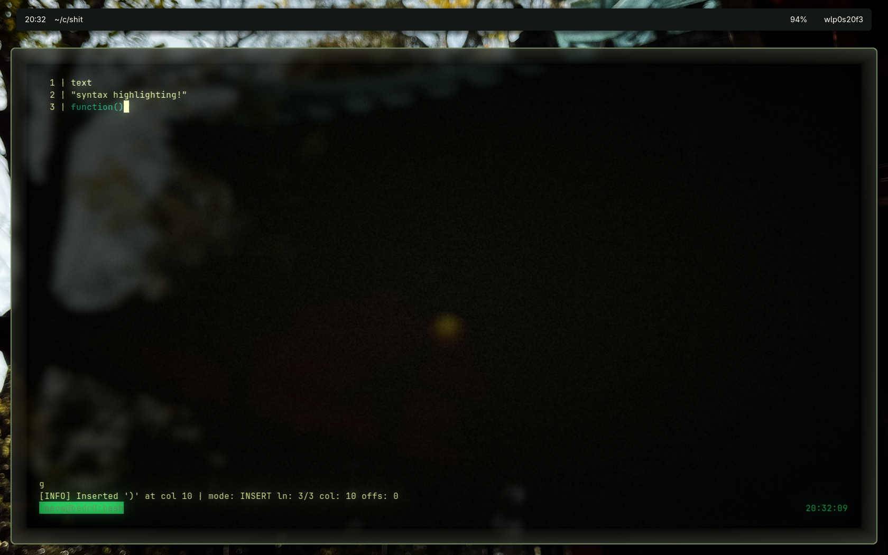
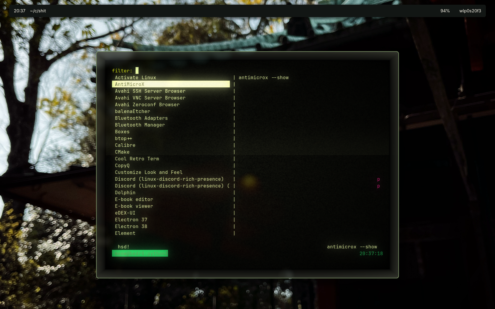

# shit
things ive made that arent big enough to be their own repo

## bash-2048
simply put : 2048 written in bash.

## bim (bash-vim)
same thing : extremely basic vi/vim written in bash.

## pylauncher
a terminal app launcher made in python ; because i didnt find any that i like.

